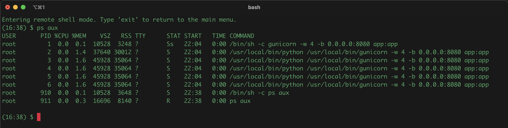

# FlaskCommander (Project Overview)

This project provides a simple Flask application that allows users to execute shell commands inside a Docker container remotely via HTTP requests. This can be very useful during development when you need to run commands on a container but don't have direct shell access to it.

## How It Works
The main Flask application (app.py) consists of two routes:

- /hello: This is a simple GET endpoint that returns "Hello, World!" when accessed.
- /exec: This POST endpoint receives a JSON object containing a shell command and a security token. If the provided security token matches the FLASK_TOKEN environment variable, the shell command is executed inside the Docker container. The output of the command is then returned in the response.

## Security Notice
Don't use this in production. While this project is designed for development use, it's important to note that it should not be used in production environments. Allowing arbitrary command execution through an HTTP API presents a significant security risk. Unauthorized access to this API could potentially allow an attacker to execute malicious commands inside your Docker container. The FLASK_TOKEN is used as a simple form of authentication, but it does not provide enough security for a production environment.

## Using this project

### setup project env vars
```console
 export PROJECT_ID='your-gcp-project-id'
 export REGION='gcp-region'
 export FLASK_TOKEN='some-token'
 export IMAGE='container-image-name'
```

### Login to gcloud
```console
 gcloud auth login
 gcloud config set project ${PROJECT_ID}
```

### Build and push the container to gcloud gcr.io
```console
  docker build -t gcr.io/${PROJECT_ID}/${IMAGE} .
  docker push gcr.io/${PROJECT_ID}/${IMAGE}
```

### Deploy the app to cloud-run
```console
  gcloud run deploy exec-api \
  --project=$PROJECT_ID \
  --image gcr.io/$PROJECT_ID/$IMAGE:latest \
  --platform managed \
  --no-cpu-throttling \
  --region $REGION \
  --allow-unauthenticated \
  --memory 2Gi \
  --cpu 2 \
  --set-env-vars "FLASK_TOKEN=${FLASK_TOKEN}"
```

### Export the URL as a var and hit /hello:
```console
  export URL='https://exec-api-niiqsik64q-uc.a.run.app'
  curl ${URL}/hello
```

### POST a command to run:
```console 
    curl -s -X POST -H "Content-Type: application/json" \
      -d "{\"command\":\"ls -l\", \"token\":\"${FLASK_TOKEN}\"}" \
      ${URL}/exec 
```

### Pipe the output through jq
```console
    curl -s -X POST -H "Content-Type: application/json" \
      -d "{\"command\":\"ls -l\", \"token\":\"${FLASK_TOKEN}\"}" \
      ${URL}/exec | jq -r .output
```

## Putting it all together.
```console
  ./flask-commander.sh  
```



